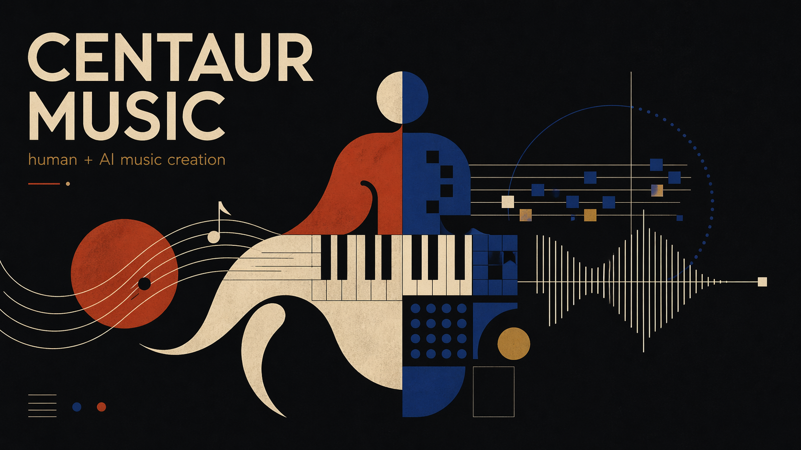

# centaur musical workstation



Exploring musical collaboration with agentic AI, focused on tuning systems that
are awkward to work with in traditional tools: just intonation, harmonic series,
septimal harmony, and other xenharmonic ideas.

The synths are custom-built to work natively in any tuning. The effects are a mix
of internal DSP and external plugins (VST3 on macOS and Linux). The composition
tools are designed for ratio-space thinking rather than retrofitting 12-tone
assumptions. The AI agent is a co-composer.

This repo contains both the toolkit and the pieces: sketches, studies, and more
developed works. Not everything sounds good yet, and that's fine.

## What can it do?

**Compose in just intonation and other xenharmonic tunings.** The score model
works in frequency ratios, not MIDI note numbers. Phrases, voices, effects, and
humanization are all tuning-agnostic from the ground up.

**18 synth engines** (16 native + 2 plugin hosts) designed for microtonal work.
Native tonal: `additive` (with spectral partial control for timbre-harmony
fusion), `fm`, `filtered_stack`, `polyblep`, `va` (supersaw / spectral-wave
with dual-filter routing, comb, and voice-level distortion), `organ` (drawbar
with tonewheel drift and scanner chorus), `piano` (modal with hammer physics),
`harpsichord` (pluck + modal resonators), and legacy `piano_additive`. Native
percussive: `drum_voice` (unified composable drum engine with 808/909 presets
plus Machinedrum-inspired EFM, PI modal, and sample-exciter kernels and a full
shaper palette), plus the dedicated `kick_tom`, `snare`, `clap`,
`metallic_perc`, `noise_perc`, and `sample` engines. Plugin hosts: Surge XT
(FM, VA) and Vital (wavetable) via MPE-style VSTi hosting.

**Vital-style modulation matrix.** Per-connection routing with source
(LFO, envelope, macro, velocity, random, constant, drift, oscillator),
destination, amount, bipolar/stereo/power shaping, and combine modes. A
whitelisted subset of engine params (cutoff, pulse width, detune, osc
spread) accepts per-sample audio-rate modulation.

**Deep filter and analog-character palette.** Eight filter topologies
(SVF, ladder, Sallen-Key, cascade, SEM, Jupiter, K35, diode), an optional
Newton-iterated ZDF solver with quality modes, per-voice distortion slots
(`voice_dist_mode`), and analog-character params covering voice-card
spread, CV jitter, phase noise, and oscillator imperfections.

**Physical-model spectrum builders.** `spectra.py` generates partial sets
for membranes, bars, plates, tubes, bowls, vowel formants, and
fractal/stretched spectra. Plug them straight into the additive or
drum_voice engines for timbre-harmony co-design.

**Phrase-first composition.** Build motifs with `line()` and `ratio_line()`,
transform them with `concat`, `overlay`, `echo`, place them with `sequence` and
`canon`, build harmony with `voiced_ratio_chord` and `progression`. An optional
metered-time layer adds bar/beat grid helpers and swing.

**Generative tools.** Weighted pitch pools, euclidean rhythms, probability gates,
Markov chains, Turing machine sequencers, harmonic lattice walkers, and
stochastic cloud generators. Rhythm helpers: `prob_rhythm` (weighted metric
probability), `AksakPattern` (additive meter with Balkan/Turkish presets),
`ca_rhythm` and `ca_rhythm_layers` (cellular-automata rhythms), and
`mutate_rhythm` (stochastic groove variation). All seeded and deterministic.

**Full MIDI export** with per-voice stems and shared tuning files (Scala, TUN,
KBM) for loading into external synths and DAWs. Start your tracks here and finish
them in your favorite DAW. (Most early 2026 LLMs have poor or nonexistent audio support,
so fine-grained mixing tweaks are better done in a DAW, either on audio stems or from MIDI
with tuning files / MPE.)

**Audio stem export.** `make stems` writes per-voice wet or dry WAVs plus send
bus returns and an optional mastered reference mix, alongside a JSON manifest
describing the bundle. Pairs with MIDI export as a DAW on-ramp.

**Render analysis and visual feedback.** Mel spectrograms, tuning-aware
chromagrams, spectral contrast, artifact-risk warnings, effect-chain diagnostics,
and timing-drift analysis, which are the primary feedback channel since most LLMs can't hear
audio.

**85+ registered pieces and studies** across JI, harmonic series, septimal,
Colundi-inspired, trance, and contrapuntal directions. Most are stubs, unfinished,
or academic. A few sound decent, I think. Flagship pieces to start from:
`slow_glass_v2`, `iron_pulse`, `tape_hymn`, `va_showcase`, `mod_matrix_study`.

## Quick start

Requires [uv](https://docs.astral.sh/uv/) for environment management. Never run
bare `python` -> always use `make` targets or prefix with `uv run`.

```bash
make list                            # see all registered pieces
make render PIECE=septimal_bloom     # render a piece + piano-roll plot + analysis
make snippet PIECE=ji_chorale AT=2:10 WINDOW=12   # render a short section
make inspect PIECE=ji_chorale AT=2:10              # inspect score context
make midi PIECE=ji_chorale           # export MIDI bundle with tuning files
make test                            # run the full test suite
make all                             # format-check + lint + typecheck + tests
make inspire                         # musical inspiration prompts
```

## Musical direction

The current center of gravity:

- just intonation and harmonic-series writing, including otonal and utonal
  materials
- a bias toward pleasant, listenable results without becoming timid or
  conventional
- willingness to move between gentle clarity and more chaotic or alien sections
- full compositions over sketches — form, pacing, arrival, and return

AGENTS.md contains my personal preference and inspirations.
Humans should almost certainly tweak it to suit their preferences.

## Project map

```mermaid
flowchart LR
    subgraph Authoring
        pieces["pieces/<br/>named works"]
        composition["composition.py<br/>phrases, canons, progressions"]
        generative["generative/<br/>euclidean, Markov, clouds"]
        meter["meter.py<br/>bars, beats, tuplets"]
    end

    subgraph Model["Score Model"]
        score["score.py<br/>Score • Voice • Phrase • Note"]
        tuning["tuning.py<br/>JI, harmonic series, EDO"]
        spectra["spectra.py<br/>membrane, bar, plate, vowel"]
    end

    subgraph Expression
        automation["automation.py<br/>parameter curves"]
        modulation["modulation.py<br/>Vital-style matrix"]
        humanize["humanize.py<br/>timing/velocity drift"]
        pitch_motion["pitch_motion.py<br/>glide/vibrato/bend"]
        drift["smear.py, harmonic_drift.py<br/>textural drift"]
    end

    subgraph Synthesis
        engines["engines/<br/>18 synth engines"]
        synth["synth.py<br/>DSP + effects"]
        drum_helpers["drum_helpers.py<br/>drum bus routing"]
    end

    subgraph Output["Output & Analysis"]
        render["render.py<br/>orchestration"]
        midi["midi_export.py / midi_import.py<br/>MIDI + tuning files"]
        stems["stem_export.py<br/>per-voice WAVs"]
        analysis["analysis.py<br/>spectrograms, chromagrams"]
        inspection["inspection.py<br/>timestamp inspector"]
        evaluate["evaluate.py<br/>LLM judges"]
    end

    Authoring --> Model
    Model --> Synthesis
    Expression --> Synthesis
    Synthesis --> Output
```



| Layer | Module | Purpose |
|-------|--------|---------|
| Authoring | `pieces/` | Named musical works (studies, sketches, full pieces) |
| Authoring | `composition.py` | Phrase-first helpers: `line`, `canon`, `progression`, metered-time grid |
| Authoring | `generative/` | Euclidean rhythms, Markov chains, lattice walkers, stochastic clouds |
| Authoring | `meter.py` | Bars, beats, tuplets, grooves, rhythmic values |
| Score Model | `score.py` | `Score` / `Voice` / `Phrase` / `NoteEvent` — the ratio-space composition API |
| Score Model | `tuning.py` | Just intonation, harmonic series, utonal, EDO helpers |
| Score Model | `spectra.py` | Physical-model partial sets: membrane, bar, plate, tube, bowl, vowel |
| Expression | `automation.py` | Parameter curves at score, voice, and note time |
| Expression | `modulation.py` | Vital-style per-connection modulation matrix |
| Expression | `humanize.py` | Timing, envelope, and velocity humanization specs |
| Expression | `pitch_motion.py` | Per-note glide, vibrato, linear bend |
| Expression | `smear.py`, `harmonic_drift.py` | Loveless-style smearing; JI-aware pitch drift |
| Synthesis | `engines/` | 18 synth engines (native + Surge XT / Vital plugin hosts) |
| Synthesis | `synth.py` | Low-level DSP, rendering, effect chain primitives |
| Synthesis | `drum_helpers.py` | Drum bus and voice convenience helpers |
| Output | `render.py` | Named-piece orchestration (`make render`) |
| Output | `midi_export.py`, `midi_import.py` | MIDI + Scala/TUN/KBM tuning files |
| Output | `stem_export.py` | Per-voice WAVs, send returns, mastered reference |
| Output | `analysis.py` | Mel spectrograms, tuning-aware chromagrams, artifact warnings |
| Output | `inspection.py` | Score-context inspection at a timestamp |
| Output | `evaluate.py` | LLM-judge scoring (Opus / Sonnet) |

## Documentation

- `docs/synth_api.md`: synth engines, presets, and effect chain reference
- `docs/score_api.md`: score model, render pipeline, expression controls
- `docs/composition_api.md`: composition helpers, generative tools, humanization
- `docs/midi_export.md`: MIDI export with per-voice stems and tuning files
- `AGENTS.md`: agent instructions, running commands, musical direction
- `FUTURE.md`: roadmap, ideas, and things to explore
